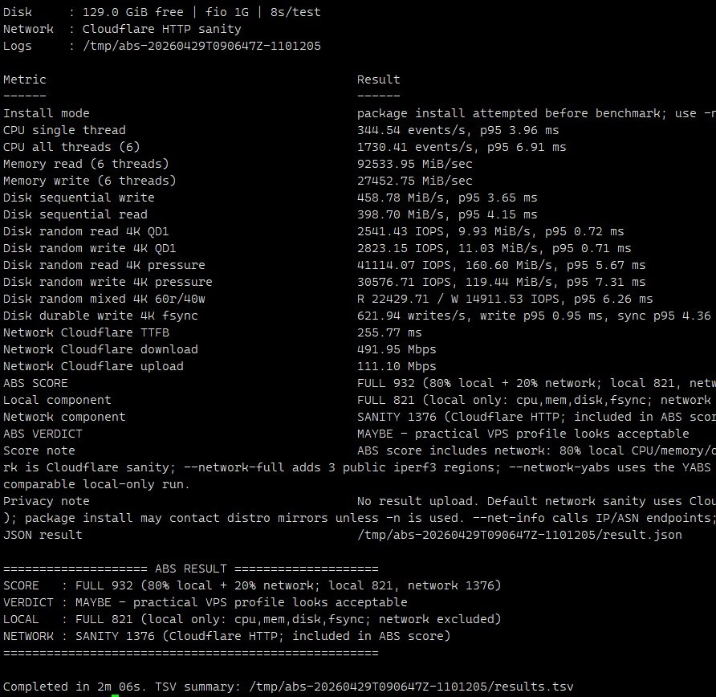
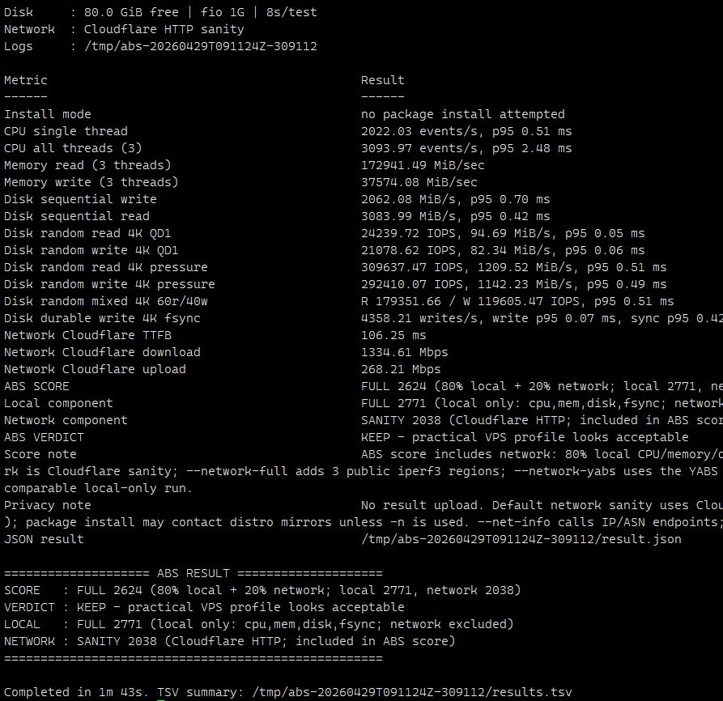

# ABS — AskClaw Benchmark Script

ABS is a quick VPS benchmark that ends with a simple verdict:

```text
KEEP / MAYBE / AVOID / INCOMPLETE
```

It helps answer one question:

> **Should I keep this VPS?**

## Run it

```bash
curl -fsSL https://raw.githubusercontent.com/getaskclaw/abs/main/abs.sh | bash
```

Default run:

- takes about **under 3 minutes** after dependencies are installed
- may install missing tools: `sysbench`, `fio`, `python3`, `curl`
- tests CPU, memory, disk, fsync, and a short Cloudflare network sanity check
- uploads **nothing**

## Read the result

At the end, look for this block:

```text
==================== ABS RESULT ====================
SCORE   : FULL 2624 (80% local + 20% network; local 2771, network 2038)
VERDICT : KEEP - practical VPS profile looks acceptable
LOCAL   : FULL 2771 (local only: cpu,mem,disk,fsync; network excluded)
NETWORK : SANITY 2038 (Cloudflare HTTP; included in ABS score)
====================================================
```

Meaning:

- **KEEP** — looks good for practical VPS use
- **MAYBE** — usable, but has weaknesses or depends on price/location
- **AVOID** — weak result; probably not worth keeping
- **INCOMPLETE** — important tests failed or were skipped

If you see `PARTIAL - not comparable`, do not compare that score with full runs. Usually `fio`, `python3`, or network access was missing.

## Bigger specs can be worse

Do not trust VPS plan labels alone.

A **6 vCPU / 16 GB RAM** VPS can be much worse than a **3 vCPU / 12 GB RAM** VPS because providers differ in CPU sharing, storage latency, noisy neighbors, and routing.

Real ABS example:

| 6 vCPU / 16 GB: MAYBE | 3 vCPU / 12 GB: KEEP |
|---|---|
|  |  |

## Common commands

```bash
# normal run
curl -fsSL https://raw.githubusercontent.com/getaskclaw/abs/main/abs.sh | bash

# quick smoke test
curl -fsSL https://raw.githubusercontent.com/getaskclaw/abs/main/abs.sh | bash -s -- --quick

# stronger local test
curl -fsSL https://raw.githubusercontent.com/getaskclaw/abs/main/abs.sh | bash -s -- --full

# no package installation
curl -fsSL https://raw.githubusercontent.com/getaskclaw/abs/main/abs.sh | bash -s -- -n

# skip network checks
curl -fsSL https://raw.githubusercontent.com/getaskclaw/abs/main/abs.sh | bash -s -- --no-network

# stronger network test: Cloudflare + 3 public iperf3 regions
curl -fsSL https://raw.githubusercontent.com/getaskclaw/abs/main/abs.sh | bash -s -- --network-full

# YABS-style network list
curl -fsSL https://raw.githubusercontent.com/getaskclaw/abs/main/abs.sh | bash -s -- --network-yabs
```

## China / restricted DNS fallback

If `raw.githubusercontent.com` or `cdn.jsdelivr.net` cannot resolve, try:

```bash
curl --resolve cdn.jsdelivr.net:443:104.16.175.226 \
  -fsSL https://cdn.jsdelivr.net/gh/getaskclaw/abs@main/abs.sh | bash -s -- -n
```

This uses `-n` / `--no-install` to avoid hanging on broken or slow package mirrors.

Warning: if `fio` or `python3` is missing, disk/fsync will be skipped and the score may be partial.

## What ABS measures

- **CPU** — sysbench single-thread and all-thread throughput
- **Memory** — sysbench read/write throughput
- **Disk** — fio sequential and 4K random tests
- **Durable write** — fio 4K fsync test
- **Network** — Cloudflare HTTP sanity check by default

If `fio` is missing, ABS may run a small `dd` disk fallback. That fallback is only a rough sanity check and is **not scored**.

## Score formula

Headline score:

```text
80% local CPU/memory/disk/fsync + 20% network
```

ABS also prints separate local and network components so you can see what helped or hurt the result.

Network is useful but noisy. Cloudflare and public iperf3 results depend on routing, location, and server load.

## Useful options

```text
--quick              ~60s smoke profile
--full               stronger 5–8 min profile
-d, --duration SEC   seconds per timed test
-z, --size SIZE      fio test file size, e.g. 512M, 2G, 8G
-t, --threads N      CPU/memory benchmark threads
-n, --no-install     do not install missing packages

--network            Cloudflare network sanity test (default)
--network-full       Cloudflare + 3 public iperf3 regions
--network-yabs       Cloudflare + current YABS public iperf3 list
--no-network         skip network checks; score becomes partial
--iperf HOST[:PORT]  add your own iperf3 server

--net-info           check IPv4/IPv6 and external IP/ASN
--json               print JSON result
--json-file PATH     copy JSON result to PATH
--verbose            print full system/tool header
-h, --help           help
```

## Privacy and files

ABS does **not** upload benchmark results.

External calls:

- default network check uses Cloudflare: about 25 MB download and 10 MB zero-data upload
- `--network-full` and `--network-yabs` call public iperf3 servers
- `--net-info` calls external IP/ASN endpoints
- default install mode may contact distro package mirrors

Local output is saved under `/tmp/abs-*`:

- `results.tsv`
- `result.json`
- raw logs

Disk test files are temporary and removed after the run.

## License

MIT
