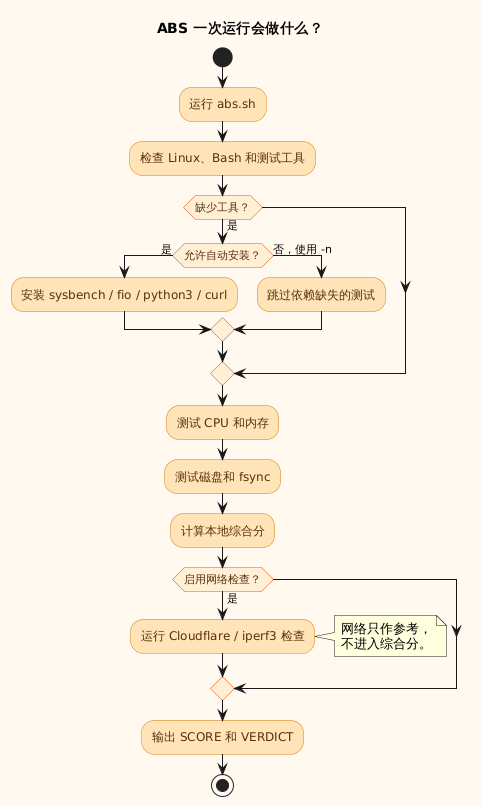
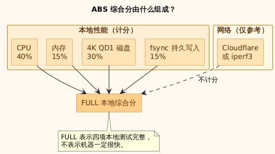
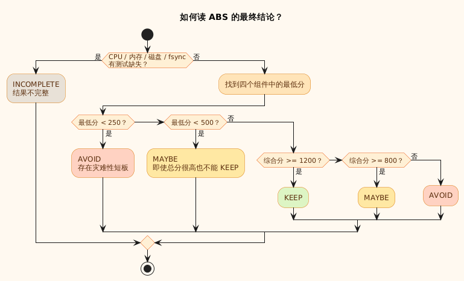

# ABS — AskClaw VPS 跑分脚本

[English](README.en.md)

ABS 用来测试 Linux VPS（虚拟服务器）的 CPU、内存和磁盘，最后给出一个简单结论：

```text
KEEP / MAYBE / AVOID / INCOMPLETE
```

它主要回答：**这台 VPS 值不值得继续留着？**

## 开始运行

```bash
curl -fsSL https://raw.githubusercontent.com/getaskclaw/abs/main/abs.sh | bash
```

默认测试通常在依赖安装后 **3 分钟内**结束。脚本可能自动安装 `sysbench`、`fio`、`python3` 和 `curl`。

不希望自动安装软件时，加 `-n`：

```bash
curl -fsSL https://raw.githubusercontent.com/getaskclaw/abs/main/abs.sh | bash -s -- -n
```

> `curl | bash` 会直接执行下载内容。需要先检查脚本时：
>
> ```bash
> curl -fsSLo abs.sh https://raw.githubusercontent.com/getaskclaw/abs/main/abs.sh
> less abs.sh
> bash abs.sh
> ```

## 它会做什么？

[](docs/diagrams/how-abs-works.svg)

- **CPU**：单线程速度和多线程表现
- **内存**：读取、写入速度
- **磁盘**：顺序读写、4K 随机读写
- **fsync**：数据真正写入磁盘的能力
- **网络**：简短的 Cloudflare 检查，仅供参考

ABS **不会上传跑分结果**。

## 怎么看结果？

运行结束后看最后这个区块：

```text
==================== ABS RESULT ====================
SCORE   : FULL 1372 (local only; network reference 2524)
VERDICT : KEEP - practical VPS profile looks acceptable
LOCAL   : FULL 1372 (local only: cpu,mem,disk,fsync; network excluded)
NETWORK : SANITY 2524 (Cloudflare HTTP; reference only, not in score)
====================================================
```

先看 `VERDICT`：

| 结果 | 含义 |
|---|---|
| `KEEP` | 本地性能整体不错，可以留 |
| `MAYBE` | 能用，但有明显短板；还要结合价格和位置 |
| `AVOID` | 本地性能较弱，通常不值得留 |
| `INCOMPLETE` | 核心测试有缺失，暂时不能下结论 |

再看 `SCORE`：

- `FULL`：CPU、内存、磁盘、fsync 都测完了
- `PARTIAL - not comparable`：结果不完整，不能与 `FULL` 直接比较
- `FULL` 只表示测试完整，不表示机器一定很快

## 分数怎么算？

[](docs/diagrams/score-model.svg)

```text
40% CPU + 15% 内存 + 30% 4K QD1 磁盘 + 15% fsync
```

网络不计分，因为它容易受到测试地点、线路和公共服务器负载影响。

ABS 还会检查最弱的组件，防止“CPU 很强”掩盖“磁盘几乎不可用”：

[](docs/diagrams/verdict-flow.svg)

```text
最低组件分 < 250       → AVOID
250 ≤ 最低组件分 < 500 → 最多 MAYBE
最低组件分 ≥ 500       → 再看综合分
```

## 常用命令

```bash
# 快速检查，约 60 秒
curl -fsSL https://raw.githubusercontent.com/getaskclaw/abs/main/abs.sh | bash -s -- --quick

# 更完整的测试，约 5–8 分钟
curl -fsSL https://raw.githubusercontent.com/getaskclaw/abs/main/abs.sh | bash -s -- --full

# 跳过网络；本地 FULL 分数仍可比较
curl -fsSL https://raw.githubusercontent.com/getaskclaw/abs/main/abs.sh | bash -s -- --no-network

# 不自动安装软件
curl -fsSL https://raw.githubusercontent.com/getaskclaw/abs/main/abs.sh | bash -s -- -n

# 保存 JSON
curl -fsSL https://raw.githubusercontent.com/getaskclaw/abs/main/abs.sh | bash -s -- --json-file result.json

# Cloudflare + 3 个公共 iperf3 区域
curl -fsSL https://raw.githubusercontent.com/getaskclaw/abs/main/abs.sh | bash -s -- --network-full
```

## 运行要求与注意事项

- 需要 Linux 和 Bash；Alpine 最小系统先运行 `apk add bash`
- `fio` 缺失时，`dd` 只能做粗略磁盘检查，不计分
- `DIRECT=0` 容易被系统缓存虚高，因此标记为 `PARTIAL - not comparable`
- 日志保存在随机、私有的 `/tmp/abs.*` 目录
- 磁盘测试只清理本次创建的文件，不碰原有 `abs.test*` 或 `abs-dd.test`

默认网络检查约下载 25 MB、上传 10 MB 测速数据。`--network-full` 会连接公共 iperf3 服务器；`--net-info` 会查询外部 IP/ASN。自动安装依赖时会访问 Linux 软件源。

<details>
<summary>中国网络无法访问 GitHub Raw 时</summary>

```bash
curl --resolve cdn.jsdelivr.net:443:104.16.175.226 \
  -fsSL https://cdn.jsdelivr.net/gh/getaskclaw/abs@main/abs.sh | bash -s -- -n
```

`-n` 可避免软件源不可用时长时间等待。

</details>

## 开发测试

```bash
python3 -m unittest -v tests/test_abs.py
```

GitHub Actions 会在每次 push 和 pull request 时运行回归测试。UML 源文件在 [`docs/diagrams/`](docs/diagrams/)；点击 README 图片可打开 SVG 矢量图。

## License

MIT
